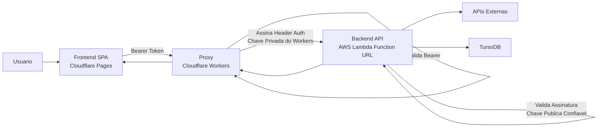

# ARCHITECTURE.md

## Objetivo
Definir a arquitetura técnica do monorepo e os limites de responsabilidade entre frontend, proxy e backend.

## Fonte de Verdade
- Este arquivo é a referência para stack, organização de pastas, camadas e fluxo técnico.
- Regras de implementação detalhadas ficam em `agent-docs/CODING.md`.
- Regras de segurança ficam em `agent-docs/SECURITY.md`.

## Stack Base (Atual)
- Yarn (workspace/monorepo)
- TypeScript
- Frontend SPA: React (Cloudflare Pages)
- Proxy/API Gateway: Cloudflare Workers
- Backend API: AWS Lambda Function URL
- Banco de dados: TursoDB
- ORM e migrations: Drizzle ORM + Drizzle Kit (no backend)
- ESLint
- Zod para validação na borda

## Overview Arquitetural
- `frontend` (Cloudflare Pages) nunca chama o backend diretamente.
- Toda chamada do frontend passa obrigatoriamente pelo proxy em Cloudflare Workers.
- O Workers valida o bearer token recebido do frontend.
- O Workers gera um header de autenticação assinado com chave privada do próprio Workers.
- O Workers encaminha a requisição para o backend (Lambda Function URL).
- O backend valida a assinatura com chave pública confiável para garantir que a chamada veio do Workers.
- Somente após validar origem/autenticidade o backend processa a requisição.
- O backend concentra regras de negócio, integrações externas e acesso ao TursoDB.

## Fluxo Arquitetural (Mermaid)


## Arquitetura do Monorepo
```text
.
├─ frontend/
│  ├─ src/
│  │  ├─ routes/
│  │  ├─ components/
│  │  ├─ services/
│  │  ├─ hooks/
│  │  ├─ state/
│  │  ├─ shared/
│  │  └─ assets/
│  └─ public/
├─ backend/
│  ├─ drizzle.config.ts
│  ├─ migrations/
│  └─ src/
│     ├─ app/
│     ├─ modules/
│     ├─ shared/
│     └─ infra/
│        └─ database/
│           └─ turso/
│              ├─ schema/
│              ├─ repositories/
│              ├─ drizzle-db.ts
│              ├─ turso-client.ts
│              └─ migrate.ts
├─ proxy/
│  └─ src/
│     ├─ app/
│     ├─ auth/
│     ├─ routing/
│     └─ shared/
└─ agent-docs/
```

## Responsabilidades por Camada

### Frontend (`frontend/`)
- Responsável por UI, experiência mobile-first, navegação e estado de apresentação.
- Consome apenas endpoints publicados pelo proxy (Workers).
- Não pode consumir API externa diretamente.
- Não pode centralizar regras de negócio de domínio.

### Proxy (`proxy/` - Cloudflare Workers)
- Ponto único de entrada das chamadas vindas do frontend.
- Valida bearer token de entrada.
- Gera e injeta header de autenticação assinado (chave privada do proxy).
- Encaminha requisições para o backend correto (Lambda URL).
- Aplica políticas transversais: rate limit, observabilidade e controles de borda.

### Backend (`backend/` - Lambda URL)
- Valida assinatura/origem da chamada com chave pública confiável.
- Responsável por regras de negócio, casos de uso, idempotência e integrações.
- Conecta-se a APIs externas e ao TursoDB.
- Centraliza schema/migrations com Drizzle no backend.
- Expõe contratos estáveis para consumo via proxy.
- Toda entrada deve ser validada com `zod` na borda.

## Arquitetura de Persistencia (Backend + Turso + Drizzle)
- Fonte de verdade de schema: arquivos de schema Drizzle em `backend/src/infra/database/turso/schema/*`.
- Migrations SQL versionadas: geradas pelo Drizzle Kit em `backend/migrations/`.
- Execucao de migrations:
  - Desenvolvimento: opcionalmente automatica por flag de ambiente.
  - Producao: etapa explicita de pipeline/deploy antes de publicar nova versao.
- Acesso a banco:
  - `modules/*` define contratos de repositorio (sem dependencia de ORM).
  - `infra/database/turso/repositories/*` implementa contratos com Drizzle.
  - `app/*` apenas compoe dependencias e adapta transporte (HTTP/Lambda).

## Fronteira Client x Proxy x Backend (Obrigatória)
- O client envia bearer token para o proxy.
- O proxy valida token e autentica tecnicamente a chamada para o backend.
- O backend só processa requisições autenticadas e verificadas via assinatura do proxy.
- Segredos e chaves privadas nunca devem estar no client.

## Fluxo Técnico de Referência
1. Usuário interage com a UI no `frontend` (SPA React).
2. Frontend chama o proxy no Workers com bearer token.
3. Workers valida o bearer token.
4. Workers assina header de autenticação com chave privada e encaminha ao backend.
5. Backend valida assinatura com chave pública e autentica origem da chamada.
6. Backend valida payload com `zod`.
7. Backend executa regra de negócio e integra APIs externas/TursoDB.
8. Backend retorna resposta ao Workers, que repassa ao frontend.

## Requisitos de Segurança Arquitetural
- Chaves privadas de assinatura ficam apenas no Workers.
- Chaves públicas de validação ficam no backend, com rotação controlada.
- Backend deve negar qualquer requisição sem assinatura válida do Workers.
- Tokens e segredos nunca são logados em formato bruto.

## Princípios Arquiteturais
- Mobile-first por padrão em decisões de interface.
- AI-first no ciclo de entrega (implementação, revisão, testes e documentação).
- Mudanças pequenas, incrementais e testáveis.
- Separação clara entre apresentação, borda/proxy e domínio.
- Sem `any` sem justificativa técnica registrada.

## Decisões e Tradeoffs
- Frontend em Pages simplifica distribuição global de SPA.
- Workers como proxy centraliza autenticação técnica e políticas de borda.
- Lambda URL reduz overhead inicial de gateway para POC.
- Validação por assinatura entre Workers e backend aumenta segurança de origem.
- Introduz mais uma camada (proxy), mas melhora controle de segurança e evolução.

## Critérios de Conformidade Arquitetural
- Frontend nunca chama backend diretamente.
- Toda chamada passa pelo Workers.
- Backend valida autenticidade/origem via chave pública antes de processar.
- Integrações externas e banco (TursoDB) existem apenas no backend.
- Schema e migrations do banco ficam centralizados no backend com Drizzle.
- Módulos TypeScript seguem convenção definida em `agent-docs/CODING.md`.

## Referências
- Padrões de implementação: `agent-docs/CODING.md`
- Controles de segurança: `agent-docs/SECURITY.md`
- Deploy e infraestrutura: `agent-docs/INFRA-DEPLOY.md`
