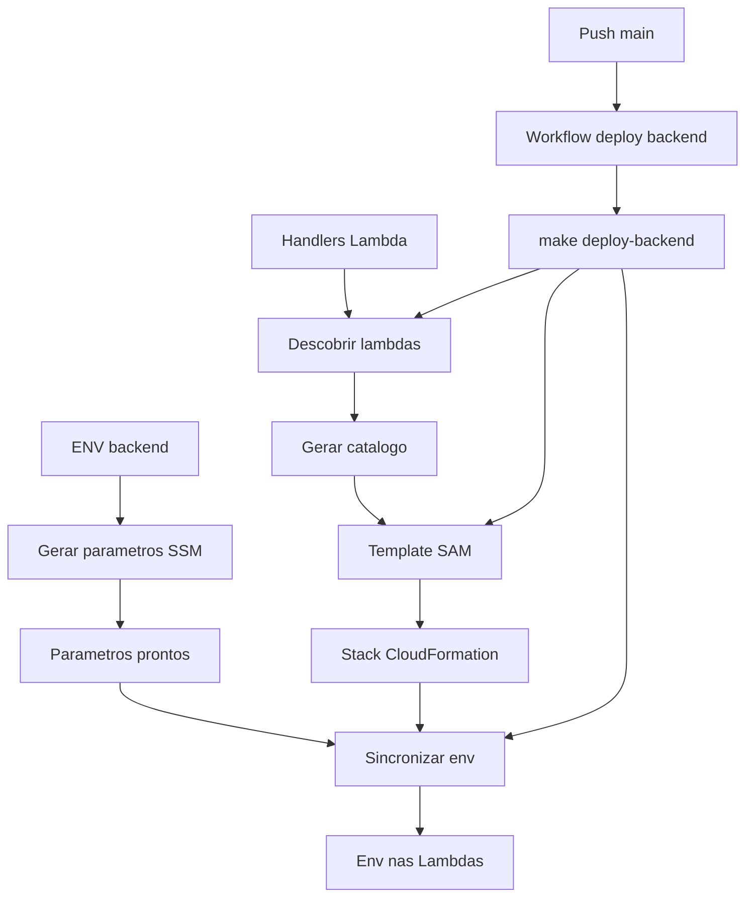

# Deploy Backend Lambda Skill

## Arquitetura Final de Deploy

## Modo de Execucao (Reconciliacao Completa Obrigatoria)
Toda execucao desta skill deve rodar em modo de reconciliacao completa, revisando todos os artefatos canonicos e garantindo consistencia fim a fim.

A skill deve considerar "bootstrap necessario" quando faltar qualquer arquivo da lista:
- `deploy/backend/discover-lambdas.ts`
- `deploy/backend/backend-serverless.yml`
- `deploy/backend/sync-lambda-env.sh`
- `deploy/backend/generated/lambdas.json`
- `.github/workflows/deploy-backend-lambda.yml` (caso ainda nao exista no repositorio)
- target `deploy-backend` no `Makefile` da raiz

Quando bootstrap for necessario, a skill deve obrigatoriamente:
- criar a estrutura de pastas `deploy/backend/generated`;
- descobrir lambdas dinamicamente em `backend/src/app/lambda/*-lambda.ts`;
- gerar `deploy/backend/generated/lambdas.json` com o catalogo inicial;
- gerar `deploy/backend/backend-serverless.yml` com funcoes, IAM e parametros SSM;
- gerar `deploy/backend/sync-lambda-env.sh` com permissao de execucao;
- criar ou atualizar o target `deploy-backend` no `Makefile`;
- criar ou atualizar o workflow `.github/workflows/deploy-backend-lambda.yml` para chamar apenas `make deploy-backend`.

Em toda execucao, a skill deve obrigatoriamente:
- revisar todos os artefatos canonicos e o target do `Makefile`;
- atualizar os arquivos que estiverem desatualizados ou divergentes das regras desta skill;
- criar os artefatos faltantes;
- manter a consistencia entre `discover-lambdas.ts`, `lambdas.json`, `backend-serverless.yml`, `sync-lambda-env.sh`, workflow e `make deploy-backend`.

A skill nao pode considerar a tarefa concluida enquanto existir qualquer artefato faltante ou divergente.

## Parametros Obrigatorios na Primeira Criacao de Artefatos CloudFormation
Quando os artefatos de CloudFormation/SAM estiverem sendo criados pela primeira vez, a skill deve solicitar explicitamente:
- `runtime` (default: `nodejs20.x`)
- `memory` (default: `512`)
- `timeout` (default: `60`)

Se o usuario nao informar, aplicar os valores default acima.

## Regra de Reconciliacao com Artefatos Existentes (Obrigatoria)
Quando os artefatos de deploy ja existirem, a skill deve obrigatoriamente:
- redescobrir lambdas dinamicamente em `backend/src/app/lambda/*-lambda.ts`;
- reler as chaves de `backend/.env`;
- comparar com Parameter Store em `/openfinance/backend/`;
- atualizar `deploy/backend/generated/lambdas.json` quando houver diferenca;
- regenerar `deploy/backend/backend-serverless.yml` quando houver diferenca de lambdas ou variaveis;
- revisar `deploy/backend/discover-lambdas.ts` e `deploy/backend/sync-lambda-env.sh` para garantir aderencia ao fluxo atual;
- revisar `.github/workflows/deploy-backend-lambda.yml` para garantir chamada unica de `make deploy-backend`;
- revisar o `Makefile` para garantir que o target `deploy-backend` exista e referencia os caminhos canonicos.

A skill nao deve assumir que artefatos existentes estao atualizados sem reconciliacao.

## Regra para Arquivo backend/.env Ausente
Se `backend/.env` nao existir, a skill deve seguir a ordem:
- usar `backend/.env.example` se existir;
- caso tambem nao exista, continuar com lista vazia de variaveis e manter o deploy funcional;
- registrar aviso explicito de que nao foi possivel carregar variaveis locais de ambiente.

## Regra de Parameter Store na Primeira Criacao
Na primeira criacao dos artefatos de deploy, a skill deve:
- ler as chaves de variaveis na ordem: `backend/.env` -> `backend/.env.example` -> lista vazia;
- criar um `AWS::SSM::Parameter` para cada entrada;
- usar o prefixo de nome exatamente como `/openfinance/backend/[variable]`;
- definir `Value: REPLACE_ME` como valor padrao inicial para todos os parametros;
- manter o tipo `String` por padrao (ou `SecureString` quando explicitamente solicitado).

## Regra de Orquestracao por Makefile
A skill deve criar/atualizar uma entrada no `Makefile` da raiz chamada:
- `deploy-backend`

Esse target deve centralizar os passos de deploy backend (descoberta de lambdas, deploy SAM e sync de env).
Os artefatos e scripts canonicos devem ficar em `deploy/backend`, incluindo:
- `deploy/backend/discover-lambdas.ts`
- `deploy/backend/backend-serverless.yml`
- `deploy/backend/sync-lambda-env.sh`

O target `deploy-backend` deve referenciar explicitamente esses caminhos.

Ao editar o `Makefile`, a skill deve atuar de forma idempotente:
- criar o target se nao existir;
- atualizar apenas o target `deploy-backend` quando existir;
- preservar targets e configuracoes nao relacionadas.

## Regra de GitHub Actions
O workflow `.github/workflows/deploy-backend-lambda.yml` deve executar o deploy chamando:
- `make deploy-backend`

O workflow nao deve duplicar a logica de deploy fora do Makefile.

Ao editar o workflow, a skill deve atuar de forma idempotente:
- criar o arquivo se nao existir;
- atualizar apenas o job/steps de deploy backend quando existir;
- preservar gatilhos, jobs e configuracoes nao relacionadas.

## Code Samples
Todos os exemplos de codigo ficam em:
- `agent-docs/skills/deploy-backend/code-sample/`

Arquivos disponiveis:
- `cloudformation/01-application-template.yml`
- `cloudformation/02-function-resource.yml`
- `cloudformation/03-iam-role-resource.yml`
- `cloudformation/04-parameter-store-resource.yml`
- `cloudformation/05-outputs.yml`
- `discover-lambdas.example.ts`
- `sync-lambda-env.example.ts`
- `deploy-backend-lambda.workflow.yml`

## Caminhos Canonicos de Saida
- Base de artefatos de deploy backend: `deploy/backend/`
- Lambdas descobertas: `deploy/backend/generated/lambdas.json`
- Template SAM: `deploy/backend/backend-serverless.yml`
- Script de sync de env: `deploy/backend/sync-lambda-env.sh`

## Critério de Conclusao da Reconciliacao (Todas as Execucoes)
A execucao so pode ser considerada concluida quando todos os itens abaixo forem verdadeiros:
- todos os artefatos canonicos existem nos caminhos definidos nesta skill;
- `discover-lambdas.ts`, `lambdas.json`, `backend-serverless.yml`, `sync-lambda-env.sh`, workflow e `Makefile` estao consistentes entre si;
- `make deploy-backend` executa localmente sem erro de arquivo ausente;
- `deploy/backend/generated/lambdas.json` contem JSON valido (ao menos `[]` quando nao houver lambdas);
- `deploy/backend/backend-serverless.yml` referencia parametros SSM no prefixo `/openfinance/backend/`;
- nao restam divergencias em relacao as regras desta skill.
