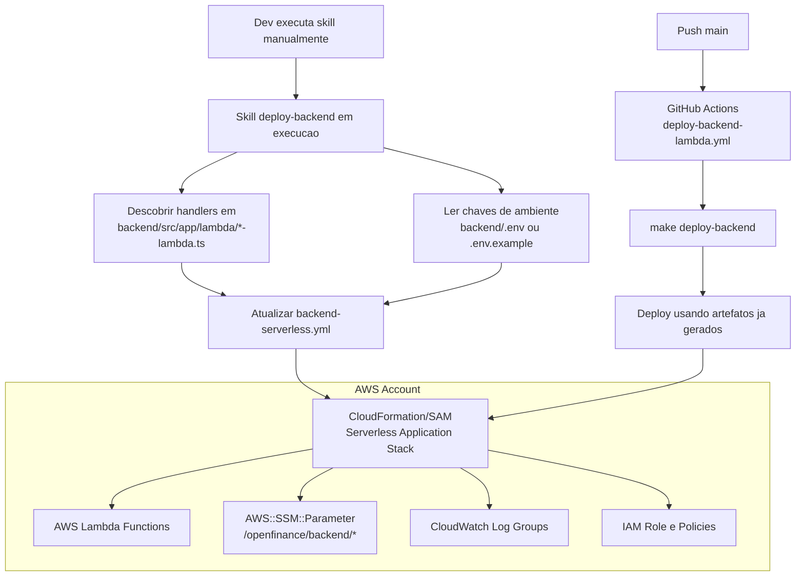

# Deploy Backend Lambda Skill

## Objetivo
Criar e reconciliar os artefatos de CloudFormation/SAM do backend, sempre sincronizados com o codigo atual do backend.

Escopo desta skill:
- gerar e atualizar `deploy/backend/backend-serverless.yml`.

Fora do escopo desta skill:
- executar deploy via `make deploy-backend`;
- editar workflow de GitHub Actions;
- editar target do `Makefile`.

A skill deve executar diretamente a descoberta de lambdas e a leitura de variaveis de ambiente durante a execucao, atualizando o template CloudFormation/SAM sem depender de scripts auxiliares intermediarios.

A skill tambem deve executar checagem obrigatoria de divergencia entre `backend/.env` (ou fallback) e AWS SSM Parameter Store.

## Arquitetura Final de Deploy



## Modo de Execucao (Reconciliacao Completa Obrigatoria)
Toda execucao desta skill deve rodar em modo de reconciliacao completa, revisando todos os artefatos canonicos e garantindo consistencia fim a fim.

## Regra de Execucao Assistida (Obrigatoria)
Esta skill deve ser executada apenas pelo DEV, de forma assistida, durante fluxo manual de desenvolvimento.

Regras bloqueantes:
- proibido executar esta skill de forma autonoma em CI/CD, cron, bot ou pipeline automatizado;
- proibido acionar reconciliacao automatica por `make deploy-backend` ou por workflow de GitHub Actions;
- toda execucao deve ter supervisao humana do DEV, incluindo revisao dos diffs gerados antes de concluir.

A skill deve considerar "bootstrap necessario" quando faltar qualquer item da lista:
- `deploy/backend/backend-serverless.yml`

Quando bootstrap for necessario, a skill deve obrigatoriamente:
- descobrir lambdas dinamicamente em `backend/src/app/lambda/*-lambda.ts` durante a execucao;
- ler chaves de ambiente na ordem `backend/.env` -> `backend/.env.example` -> lista vazia;
- gerar `deploy/backend/backend-serverless.yml` com funcoes, IAM e parametros SSM;

Em toda execucao, a skill deve obrigatoriamente:
- revisar os artefatos canonicos de CloudFormation/SAM;
- atualizar os arquivos que estiverem desatualizados ou divergentes das regras desta skill;
- criar os artefatos faltantes;
- manter a consistencia entre codigo do backend e `backend-serverless.yml`.

A skill nao pode considerar a tarefa concluida enquanto existir qualquer artefato faltante ou divergente.

## Parametros Obrigatorios na Primeira Criacao de Artefatos CloudFormation
Quando os artefatos de CloudFormation/SAM estiverem sendo criados pela primeira vez, a skill deve solicitar explicitamente:
- `runtime` (default: `nodejs20.x`)
- `memory` (default: `512`)
- `timeout` (default: `60`)

Se o usuario nao informar, aplicar os valores default acima.

## Regra de Reconciliacao com Artefatos Existentes (Obrigatoria)
Quando os artefatos de deploy ja existirem, a skill deve obrigatoriamente:
- redescobrir lambdas dinamicamente em `backend/src/app/lambda/*-lambda.ts` durante a execucao;
- reler as chaves de `backend/.env`;
- comparar com Parameter Store em `/openfinance/backend/`;
- regenerar `deploy/backend/backend-serverless.yml` quando houver diferenca de lambdas ou variaveis;

A skill nao deve assumir que artefatos existentes estao atualizados sem reconciliacao.

## Regra para Arquivo backend/.env Ausente
Se `backend/.env` nao existir, a skill deve seguir a ordem:
- usar `backend/.env.example` se existir;
- caso tambem nao exista, continuar com lista vazia de variaveis e manter o deploy funcional;
- registrar aviso explicito de que nao foi possivel carregar variaveis locais de ambiente.

## Regra de Parameter Store na Primeira Criacao
Na primeira criacao dos artefatos de deploy, a skill deve:
- ler as chaves de variaveis na ordem: `backend/.env` -> `backend/.env.example` -> lista vazia;
- criar um `AWS::SSM::Parameter` para cada entrada;
- usar o prefixo de nome exatamente como `/openfinance/backend/[variable]`;
- definir `Value: REPLACE_ME` como valor padrao inicial para todos os parametros;
- manter o tipo `String` por padrao (ou `SecureString` quando explicitamente solicitado).

## Regra de Orquestracao por Makefile
O target `deploy-backend` no `Makefile` deve executar apenas o deploy da stack usando artefatos ja gerados.

`make deploy-backend` nao deve executar discovery, reconciliacao de lambdas ou atualizacao de template.

A atualizacao de artefatos e responsabilidade exclusiva da execucao manual da skill pelo dev.

O target `deploy-backend` deve referenciar explicitamente:
- `deploy/backend/backend-serverless.yml`

Observacao: esta skill valida compatibilidade com esse contrato, mas nao deve editar `Makefile`.

## Regra de GitHub Actions
O workflow `.github/workflows/deploy-backend-lambda.yml` deve executar o deploy chamando:
- `make deploy-backend`

O workflow nao deve duplicar logica de deploy fora do Makefile e nao deve executar discovery/reconciliacao de artefatos.

Observacao: esta skill valida compatibilidade com esse contrato, mas nao deve editar workflow.

## Checagem Obrigatoria: backend/.env x SSM Parameter Store
A skill deve sempre validar divergencias entre chaves locais e chaves publicadas no SSM.

### Perfil AWS obrigatorio
Usar o perfil definido no `Makefile`:
- `mtuliomk`

### Prefixo SSM obrigatorio
- `/openfinance/backend/`

### Fluxo minimo de checagem
1. Carregar chaves locais na ordem: `backend/.env` -> `backend/.env.example` -> lista vazia.
2. Listar todos os parametros SSM via AWS CLI usando o perfil do `Makefile`, com paginacao completa.
3. Comparar apenas nomes de chaves (nunca valores).
4. Reportar 3 grupos:
- faltando no SSM (existe no `.env` e nao existe no SSM)
- sobrando no SSM (existe no SSM e nao existe no `.env`)
- alinhadas (existe em ambos)

### Exemplo de comando AWS CLI
```bash
next_token=""
while true; do
  if [ -n "$next_token" ]; then
    response=$(aws ssm get-parameters-by-path \
      --path /openfinance/backend/ \
      --recursive \
      --profile mtuliomk \
      --starting-token "$next_token")
  else
    response=$(aws ssm get-parameters-by-path \
      --path /openfinance/backend/ \
      --recursive \
      --profile mtuliomk)
  fi

  echo "$response" | jq -r '.Parameters[].Name'
  next_token=$(echo "$response" | jq -r '.NextToken // empty')
  [ -z "$next_token" ] && break
done
```

### Regras de seguranca da checagem
- Nao imprimir valores de variaveis em logs.
- Nao persistir segredos em arquivos gerados.
- Exibir somente nomes de chaves e status de divergencia.
- Nao usar `--with-decryption` nesta checagem, pois a comparacao e apenas por nome.

## Code Samples
Todos os exemplos de codigo ficam em:
- `agent-docs/skills/deploy-backend/code-sample/`

Arquivos disponiveis:
- `cloudformation/01-application-template.yml`
- `cloudformation/02-function-resource.yml`
- `cloudformation/03-iam-role-resource.yml`
- `cloudformation/04-parameter-store-resource.yml`
- `cloudformation/05-outputs.yml`
- `deploy-backend-lambda.workflow.yml` (referencia de pipeline de deploy)

## Caminhos Canonicos de Saida
- Base de artefatos de deploy backend: `deploy/backend/`
- Template SAM: `deploy/backend/backend-serverless.yml`

## Critério de Conclusao da Reconciliacao (Todas as Execucoes)
A execucao so pode ser considerada concluida quando todos os itens abaixo forem verdadeiros:
- todos os artefatos canonicos existem nos caminhos definidos nesta skill;
- codigo do backend e `backend-serverless.yml` estao consistentes entre si;
- `deploy/backend/backend-serverless.yml` referencia parametros SSM no prefixo `/openfinance/backend/`;
- a checagem `.env` vs SSM foi executada com `--profile mtuliomk` e teve resultado registrado;
- nao restam divergencias em relacao as regras desta skill.

## Definicao Objetiva de Divergencia e Consistencia (Obrigatoria)
Para evitar ambiguidade, a skill deve considerar divergencia quando houver qualquer um dos casos abaixo:
- existe handler `backend/src/app/lambda/*-lambda.ts` sem recurso correspondente em `deploy/backend/backend-serverless.yml`;
- existe recurso de funcao no template sem handler correspondente no backend (recurso orfao);
- existe chave no `.env`/`.env.example` sem parametro SSM correspondente no prefixo `/openfinance/backend/`;
- existe parametro SSM no prefixo `/openfinance/backend/` sem chave correspondente no `.env`/`.env.example`;
- recurso SSM no template fora do prefixo `/openfinance/backend/`;
- diferenca de configuracao obrigatoria por funcao no template (runtime, memory, timeout, handler, role e log group).

A skill deve considerar consistencia fim a fim apenas quando todos os itens abaixo forem verdadeiros:
- descoberta de lambdas e inventario de funcoes do template possuem cardinalidade e nomes equivalentes;
- nao existem recursos orfaos de funcao no template;
- comparacao de chaves `.env`/`.env.example` vs SSM nao possui itens faltando ou sobrando;
- todos os parametros declarados no template usam prefixo `/openfinance/backend/`;
- a regeneracao do `backend-serverless.yml` e idempotente (executar novamente sem mudanca de entrada nao altera diff do arquivo).
