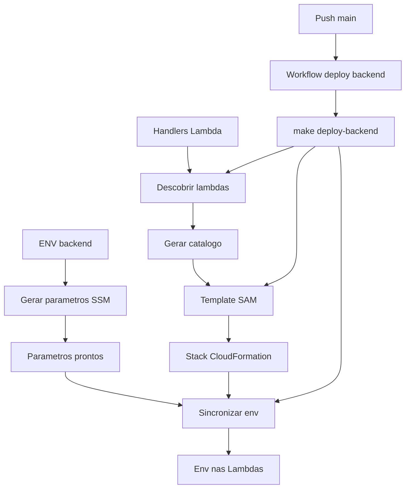

# Deploy Backend Lambda Skill

## Arquitetura Final de Deploy

## Parametros Obrigatorios na Primeira Criacao de Artefatos CloudFormation
Quando os artefatos de CloudFormation/SAM estiverem sendo criados pela primeira vez, a skill deve solicitar explicitamente:
- `runtime` (default: `nodejs24`)
- `memory` (default: `512`)
- `cpu` (default: `512`)
- `timeout` (default: `60s`)

Se o usuario nao informar, aplicar os valores default acima.

## Regra de Reconciliacao com Artefatos Existentes (Obrigatoria)
Quando os artefatos de deploy ja existirem, a skill deve obrigatoriamente:
- redescobrir lambdas dinamicamente em `backend/src/app/lambda/*-lambda.ts`;
- reler as chaves de `backend/.env`;
- comparar com Parameter Store em `/openfinance/backend/`;
- atualizar `deploy/backend/generated/lambdas.json` quando houver diferenca;
- regenerar `deploy/backend/backend-serverless.yml` quando houver diferenca de lambdas ou variaveis.

A skill nao deve assumir que artefatos existentes estao atualizados sem reconciliacao.

## Regra de Parameter Store na Primeira Criacao
Na primeira criacao dos artefatos de deploy, a skill deve:
- ler todas as chaves do arquivo `backend/.env`;
- criar um `AWS::SSM::Parameter` para cada entrada;
- usar o prefixo de nome exatamente como `/openfinance/backend/[variable]`;
- definir `Value: replace it` como valor padrao inicial para todos os parametros;
- manter o tipo `String` por padrao (ou `SecureString` quando explicitamente solicitado).

## Regra de Orquestracao por Makefile
A skill deve criar/atualizar uma entrada no `Makefile` da raiz chamada:
- `deploy-backend`

Esse target deve centralizar os passos de deploy backend (descoberta de lambdas, deploy SAM e sync de env).
Os artefatos e scripts canonicos devem ficar em `deploy/backend`, incluindo:
- `deploy/backend/discover-lambdas.ts`
- `deploy/backend/backend-serverless.yml`
- `deploy/backend/sync-lambda-env.sh`

O target `deploy-backend` deve referenciar explicitamente esses caminhos.

## Regra de GitHub Actions
O workflow `.github/workflows/deploy-backend-lambda.yml` deve executar o deploy chamando:
- `make deploy-backend`

O workflow nao deve duplicar a logica de deploy fora do Makefile.

## Code Samples
Todos os exemplos de codigo ficam em:
- `agent-docs/skills/deploy-backend/code-sample/`

Arquivos disponiveis:
- `cloudformation/01-application-template.yml`
- `cloudformation/02-function-resource.yml`
- `cloudformation/03-iam-role-resource.yml`
- `cloudformation/04-parameter-store-resource.yml`
- `cloudformation/05-outputs.yml`
- `discover-lambdas.example.ts`
- `sync-lambda-env.example.ts`
- `deploy-backend-lambda.workflow.yml`

## Caminhos Canonicos de Saida
- Base de artefatos de deploy backend: `deploy/backend/`
- Lambdas descobertas: `deploy/backend/generated/lambdas.json`
- Template SAM: `deploy/backend/backend-serverless.yml`
- Script de sync de env: `deploy/backend/sync-lambda-env.sh`
