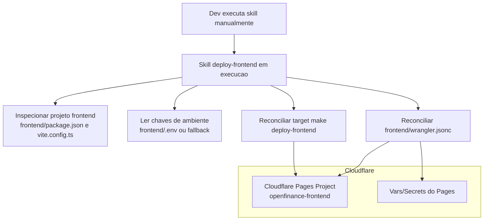

# Deploy Frontend Pages Skill

## Objetivo
Criar e reconciliar os artefatos de deploy do frontend em Cloudflare Pages, sempre sincronizados com o codigo atual do projeto `./frontend`.

Escopo desta skill:
- gerar e atualizar `frontend/wrangler.jsonc` conforme padrao arquitetural;
- criar ou atualizar o target `deploy-frontend` no `Makefile` para executar apenas o deploy do frontend em Cloudflare Pages usando artefatos ja reconciliados;
- validar divergencias entre variaveis locais (`frontend/.env`) e variaveis declaradas para o deploy do frontend.

Fora do escopo desta skill:
- executar deploy real em Cloudflare (`make deploy-frontend`, `wrangler pages deploy`);
- editar workflow de GitHub Actions;
- alterar regra de negocio de `frontend`, `proxy` ou `backend`.

## Arquitetura Final de Deploy

## Regra Arquitetural Obrigatoria (Frontend -> Proxy)
A reconciliacao deve preservar os requisitos arquiteturais:
- o frontend publicado em Pages deve consumir apenas o proxy (`./proxy`) como borda de API;
- e proibido configurar URL direta de backend/Lambda no deploy do frontend;
- segredos, tokens privados e chaves criptograficas nao podem existir em variaveis publicas do frontend.

## Modo de Execucao (Reconciliacao Completa Obrigatoria)
Toda execucao desta skill deve rodar em modo de reconciliacao completa, revisando todos os artefatos canonicos e garantindo consistencia fim a fim com o projeto `./frontend`.

## Regra de Qualidade para Esta Skill (Dispensa de Build e Testes de App)
Como esta skill atua apenas em artefatos de deploy/documentacao e nao altera codigo de aplicacao, nao e obrigatorio executar `build` e testes de `frontend`, `backend` e `proxy` durante a execucao desta skill.

Regras:
- aplicar a dispensa somente quando a mudanca estiver restrita a artefatos de deploy/documentacao da propria skill;
- se houver alteracao em codigo de aplicacao, voltar a exigir os gates de qualidade do repositorio.

## Regra de Execucao Assistida (Obrigatoria)
Esta skill deve ser executada apenas pelo DEV, de forma assistida, durante fluxo manual de desenvolvimento.

Regras bloqueantes:
- proibido executar esta skill de forma autonoma em CI/CD, cron, bot ou pipeline automatizado;
- proibido acionar reconciliacao automatica por `make deploy-frontend`;
- toda execucao deve ter supervisao humana do DEV, incluindo revisao dos diffs gerados antes de concluir.

## Bootstrap Necessario
A skill deve considerar bootstrap necessario quando faltar qualquer item da lista:
- `frontend/wrangler.jsonc`

Quando bootstrap for necessario, a skill deve obrigatoriamente:
- identificar projeto SPA em `frontend/package.json` (build via Vite);
- ler chaves de ambiente na ordem `frontend/.env` -> lista vazia;
- gerar `frontend/wrangler.jsonc` com `name`, `compatibility_date` e `pages_build_output_dir` minimos para o frontend.

## Regra de Reconciliacao com Artefatos Existentes (Obrigatoria)
Quando os artefatos de deploy ja existirem, a skill deve obrigatoriamente:
- revalidar `name`, `compatibility_date` e `pages_build_output_dir` de `frontend/wrangler.jsonc`;
- reler chaves de `frontend/.env`;
- garantir que as variaveis publicas do frontend estejam declaradas no deploy;
- regenerar `frontend/wrangler.jsonc` quando houver diferenca estrutural relevante.

A skill nao deve assumir que artefatos existentes estao atualizados sem reconciliacao.

## Regra Obrigatoria: Target de Deploy no Makefile
O target `deploy-frontend` no `Makefile` deve preparar os pre-requisitos e executar o deploy do projeto `frontend` no Cloudflare Pages.

Contrato obrigatorio do `deploy-frontend` no `Makefile`:
- executar no diretorio `frontend`;
- usar `yarn` como gerenciador de pacotes;
- executar `yarn build` antes do publish;
- publicar com `wrangler pages deploy dist --project-name <nome-projeto> --branch <branch-producao>` (sem logica de reconciliacao dentro do target);
- permitir override de ambiente/flags por variaveis de shell quando necessario.

Regra bloqueante:
- a skill pode editar `Makefile`, mas nao pode executar `make deploy-frontend`.

## Regra Obrigatoria: Variaveis do Frontend
Para aderencia a arquitetura e seguranca (`frontend -> proxy -> backend`), o deploy do frontend deve declarar somente variaveis publicas necessarias ao client.

Regras:
- nomes de chaves devem ser consistentes entre `frontend/.env` e `frontend/wrangler.jsonc`;
- variaveis sensiveis (tokens privados, segredos, chaves de assinatura) sao proibidas no frontend;
- variaveis de URL devem apontar para o proxy, nunca para backend/Lambda.

## Regra de Seguranca (Obrigatoria)
A reconciliacao deve preservar os requisitos:
- proibido introduzir variaveis publicas que exponham segredos;
- proibido configurar rota direta para backend no frontend;
- manter aderencia a sanitizacao de logs e nao imprimir valores sensiveis durante execucao da skill.

## Caminhos Canonicos de Saida
- Projeto alvo de deploy: `frontend/`
- Arquivo principal de deploy Pages: `frontend/wrangler.jsonc`
- Diretorio de build esperado: `frontend/dist`

## Criterio de Conclusao da Reconciliacao (Todas as Execucoes)
A execucao so pode ser considerada concluida quando todos os itens abaixo forem verdadeiros:
- todos os artefatos canonicos existem nos caminhos definidos nesta skill;
- `frontend/wrangler.jsonc` esta consistente com o projeto `./frontend`;
- variaveis publicas do frontend estao alinhadas com `frontend/.env` (comparacao por chave);
- target `deploy-frontend` do `Makefile` existe e cumpre o contrato desta skill;
- nao restam divergencias em relacao as regras desta skill.

## Definicao Objetiva de Divergencia e Consistencia (Obrigatoria)
A skill deve considerar divergencia quando houver qualquer um dos casos abaixo:
- ausencia de `frontend/wrangler.jsonc`;
- ausencia de `pages_build_output_dir` apontando para `dist`;
- ausencia de target `deploy-frontend` no `Makefile`;
- target `deploy-frontend` sem `--branch <branch-producao>`;
- existencia de variavel de ambiente do frontend apontando diretamente para backend/Lambda;
- existencia de chave sensivel em variavel publica do frontend.

A skill deve considerar consistencia fim a fim apenas quando:
- o inventario de configuracao de deploy representa fielmente o projeto `./frontend`;
- o deploy esta preparado para Cloudflare Pages com build output correto;
- as configuracoes de ambiente do frontend respeitam a fronteira arquitetural (consumo via proxy).
