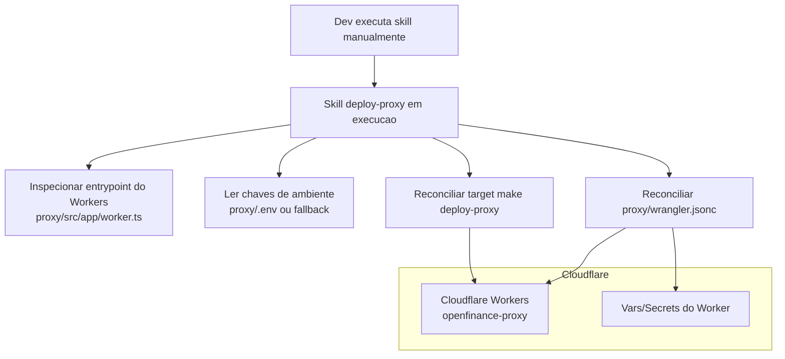

# Deploy Proxy Workers Skill

## Objetivo
Criar e reconciliar os artefatos de deploy do proxy Cloudflare Workers, sempre sincronizados com o codigo atual do projeto `./proxy`.

Escopo desta skill:
- gerar e atualizar `proxy/wrangler.jsonc` conforme padrao arquitetural;
- criar ou atualizar o target `deploy-proxy` no `Makefile` para executar apenas o deploy do Workers usando artefatos ja reconciliados;
- validar divergencias entre variaveis locais (`proxy/.env`) e variaveis declaradas para o deploy do Workers.

Fora do escopo desta skill:
- executar deploy real em Cloudflare (`make deploy-proxy`, `wrangler deploy`);
- editar workflow de GitHub Actions;
- alterar regra de negocio de `frontend` ou `backend`.

## Arquitetura Final de Deploy

## Modo de Execucao (Reconciliacao Completa Obrigatoria)
Toda execucao desta skill deve rodar em modo de reconciliacao completa, revisando todos os artefatos canonicos e garantindo consistencia fim a fim com o projeto `./proxy`.

## Regra de Qualidade para Esta Skill (Dispensa de Build e Testes de App)
Como esta skill atua apenas em artefatos de deploy/documentacao e nao altera codigo de aplicacao, nao e obrigatorio executar `build` e testes de `frontend`, `backend` e `proxy` durante a execucao desta skill.

Regras:
- aplicar a dispensa somente quando a mudanca estiver restrita a artefatos de deploy/documentacao da propria skill;
- se houver alteracao em codigo de aplicacao, voltar a exigir os gates de qualidade do repositorio.

## Regra de Execucao Assistida (Obrigatoria)
Esta skill deve ser executada apenas pelo DEV, de forma assistida, durante fluxo manual de desenvolvimento.

Regras bloqueantes:
- proibido executar esta skill de forma autonoma em CI/CD, cron, bot ou pipeline automatizado;
- proibido acionar reconciliacao automatica por `make deploy-proxy`;
- toda execucao deve ter supervisao humana do DEV, incluindo revisao dos diffs gerados antes de concluir.

## Bootstrap Necessario
A skill deve considerar bootstrap necessario quando faltar qualquer item da lista:
- `proxy/wrangler.jsonc`

Quando bootstrap for necessario, a skill deve obrigatoriamente:
- identificar entrypoint do Workers em `proxy/src/app/worker.ts`;
- ler chaves de ambiente na ordem `proxy/.env` -> lista vazia;
- gerar `proxy/wrangler.jsonc` com `name`, `main`, `compatibility_date` e `vars` minimas para o proxy.

## Regra de Reconciliacao com Artefatos Existentes (Obrigatoria)
Quando os artefatos de deploy ja existirem, a skill deve obrigatoriamente:
- revalidar `name`, `main` e `compatibility_date` de `proxy/wrangler.jsonc`;
- reler chaves de `proxy/.env`;
- garantir que as variaveis obrigatorias do proxy estejam declaradas no deploy;
- regenerar `proxy/wrangler.jsonc` quando houver diferenca estrutural relevante.

A skill nao deve assumir que artefatos existentes estao atualizados sem reconciliacao.

## Regra Obrigatoria: Target de Deploy no Makefile
O target `deploy-proxy` no `Makefile` deve preparar os pre-requisitos e executar o deploy do projeto `proxy` no Cloudflare Workers.

Contrato obrigatorio do `deploy-proxy` no `Makefile`:
- executar no diretorio `proxy`;
- usar `yarn` como gerenciador de pacotes;
- publicar com `wrangler deploy` (sem logica de reconciliacao dentro do target);
- permitir override de ambiente/flags por variaveis de shell quando necessario.

Regra bloqueante:
- a skill pode editar `Makefile`, mas nao pode executar `make deploy-proxy`.

## Regra Obrigatoria: Variaveis do Proxy
Para aderencia a arquitetura e seguranca (`frontend -> proxy -> backend`), o deploy do `proxy` deve declarar e manter, no minimo, as chaves:
- `BACKEND_BASE_URL`
- `PROXY_SIGNING_SECRET`
- `PROXY_ALLOWED_ORIGINS`

Regras:
- nomes de chaves devem ser consistentes entre `proxy/.env` e `proxy/wrangler.jsonc`;
- nao imprimir valores sensiveis em logs da skill;
- `PROXY_SIGNING_SECRET` deve ser tratado como sensivel e preferencialmente movido para secret gerenciado (`wrangler secret`) em ambientes nao-locais.

## Regra de Seguranca e Arquitetura (Obrigatoria)
A reconciliacao deve preservar os requisitos:
- `proxy` como ponto unico de entrada do frontend;
- encaminhamento apenas para backend permitido (`BACKEND_BASE_URL` controlado);
- proibido introduzir consumo direto `frontend -> backend` nos artefatos de deploy;
- manter consistencia com validacao de bearer token e assinatura tecnica proxy->backend.

## Caminhos Canonicos de Saida
- Projeto alvo de deploy: `proxy/`
- Arquivo principal de deploy Workers: `proxy/wrangler.jsonc`
- Entrypoint esperado: `proxy/src/app/worker.ts`

## Criterio de Conclusao da Reconciliacao (Todas as Execucoes)
A execucao so pode ser considerada concluida quando todos os itens abaixo forem verdadeiros:
- todos os artefatos canonicos existem nos caminhos definidos nesta skill;
- `proxy/wrangler.jsonc` esta consistente com o projeto `./proxy`;
- variaveis obrigatorias do proxy estao alinhadas com `proxy/.env` (comparacao por chave);
- target `deploy-proxy` do `Makefile` existe e cumpre o contrato desta skill;
- nao restam divergencias em relacao as regras desta skill.

## Definicao Objetiva de Divergencia e Consistencia (Obrigatoria)
A skill deve considerar divergencia quando houver qualquer um dos casos abaixo:
- ausencia de `proxy/wrangler.jsonc`;
- `main` diferente de `src/app/worker.ts` sem justificativa tecnica;
- ausencia de qualquer chave obrigatoria (`BACKEND_BASE_URL`, `PROXY_SIGNING_SECRET`, `PROXY_ALLOWED_ORIGINS`);
- diferenca de nomes de chaves entre `.env` e `wrangler.jsonc`;
- ausencia de target `deploy-proxy` no `Makefile`.

A skill deve considerar consistencia fim a fim apenas quando:
- o inventario de configuracao de deploy representa fielmente o projeto `./proxy`;
- as chaves obrigatorias estao declaradas e aderentes ao fluxo arquitetural;
- nao existem lacunas de deploy para publicacao do Workers no Cloudflare.
